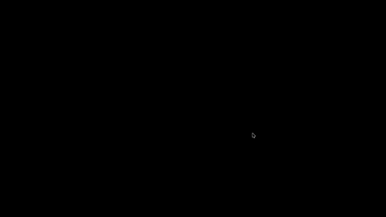

# Hyperspeedcube Recording Guide

Complete guide for creating GIFs and videos of 4D hypercube sequences for presentation and report.

---

## Quick Start

```bash
cd disp

# Enter Nix environment (has all tools)
nix develop

# Launch Hyperspeedcube
cd ../hyper/Hyperspeedcube
./target/release/hyperspeedcube &

# Record sequences (see checklist below)
# Then convert to GIF
cd ../../disp
./scripts/video_to_gif.sh recordings/your_video.mp4 figures/sequence_NAME.gif
```

---

## Prerequisites

### Built Tools (Already Done)
✅ Hyperspeedcube built at: `../hyper/Hyperspeedcube/target/release/hyperspeedcube`

### Available via Nix Shell
When you run `nix develop` in `disp/`, you get:
- ffmpeg - video recording/conversion
- gifsicle - GIF optimization
- xdotool - automation (optional)
- simplescreenrecorder - screen recording

### Alternative: System Installation
If not using Nix:

**Linux:**
```bash
sudo pacman -S ffmpeg gifsicle simplescreenrecorder  # Arch
sudo apt install ffmpeg gifsicle simplescreenrecorder  # Ubuntu/Debian
```

**macOS:**
```bash
brew install ffmpeg gifsicle
# Use Cmd+Shift+5 for screen recording
```

---

## Recording Workflow

### Step 1: Launch Hyperspeedcube

From Nix shell:
```bash
cd ../hyper/Hyperspeedcube
./target/release/hyperspeedcube &
```

If you get library errors, make sure you're in the Nix shell (`nix develop`).

### Step 2: Set Up Puzzle

In Hyperspeedcube GUI:

1. **Load puzzle**: Should default to 3^4 (3×3×3×3)
   - If not: File > Open Puzzle > 3^4
2. **Reset to solved**: Press `Ctrl+R` or Puzzle > Reset
3. **Adjust view**:
   - Rotate with mouse to get good 4D viewing angle
   - Zoom with scroll wheel (frame puzzle with ~10% border)
   - Settings > Projection: Try "Schlegel" or "Stereographic" for best 4D view
4. **Optimize for recording**:
   - Settings > Stickers > High Contrast: ON
   - Settings > Animation > Speed: 0.25x or 0.5x (slow enough to see)
   - Settings > Graphics > Quality: High/Ultra
   - View > Background: Solid black or white (clean look)

### Step 3: Record Sequence

#### Method A: SimpleScreenRecorder (Linux, Recommended)

```bash
# In separate terminal
simplescreenrecorder
```

1. Click "Continue" on welcome screen
2. Select "Record a fixed rectangle" or "Record window"
3. If window: Click "Select window" and click Hyperspeedcube
4. Frame rate: 30 fps
5. Click "Continue" → "Start recording"
6. Perform moves in Hyperspeedcube (see checklist below)
7. Stop recording in SimpleScreenRecorder
8. Save as `.mp4` in `disp/recordings/`

#### Method B: OBS Studio (Cross-platform)

1. Launch OBS
2. Add source: Window Capture → select Hyperspeedcube
3. Click "Start Recording"
4. Perform moves
5. Click "Stop Recording"
6. Save to `disp/recordings/`

#### Method C: Built-in (Quick)

**Linux (ffmpeg):**
```bash
ffmpeg -f x11grab -i :0.0 recordings/test.mp4
# Perform moves, then Ctrl+C to stop
```

**macOS:**
- Press `Cmd+Shift+5`
- Select window or screen region
- Click "Record"
- Perform moves
- Click stop in menu bar

**Windows:**
- Press `Win+G` (Xbox Game Bar)
- Click record button
- Perform moves
- Click stop

### Step 4: Perform Moves in Hyperspeedcube

**Move notation:**
- Type move names: `FR`, `UF`, `OR`, etc.
- Press Enter after each move
- Puzzle will animate the move

**Tips:**
- Start recording BEFORE typing first move
- Pause briefly between moves (at animation speed 0.25x, ~2 seconds)
- For sequences with period < 20: Record 3-4 full cycles
- For longer periods: Record 1-2 cycles or 15-20 seconds total
- End with puzzle in interesting state (or back to solved)

**Example for FR → UF:**
1. Press record
2. Type `FR` Enter (wait for animation)
3. Type `UF` Enter (wait for animation)
4. Repeat 2-3 times
5. Stop recording

### Step 5: Convert to GIF

Back in `disp/` directory (in Nix shell):

```bash
# Standard conversion (480px width, 15fps)
./scripts/video_to_gif.sh recordings/your_video.mp4 figures/sequence_NAME.gif

# Higher quality (larger file)
./scripts/video_to_gif.sh recordings/video.mp4 figures/output.gif 640 20

# Smaller file (lower quality)
./scripts/video_to_gif.sh recordings/video.mp4 figures/output.gif 320 10
```

**Parameters:**
- Width (default 480px)
- FPS (default 15)

**Target:** GIF size < 5MB for easy report inclusion

### Step 6: Verify GIF

```bash
cd figures
ls -lh sequence_*.gif

# View in browser
firefox sequence_FR_UF.gif
# or
xdg-open sequence_FR_UF.gif  # Linux
open sequence_FR_UF.gif       # macOS
```

---

## Priority Sequences (Based on Lyapunov Analysis)

See `sequences_to_record.txt` for complete checklist with data.

### TIER 1 - Must Have (Record First!)

**1. FO → FO** (λ=6.093, period=4) ⭐⭐⭐
- **Most chaotic** self-composition found
- Shows extreme sensitivity despite SHORT period
- Record 3-4 full cycles (~10 seconds)
- Filename: `figures/sequence_FO_FO.gif`

**2. FR single** (λ=0.0, period=8) ⭐⭐⭐
- **Baseline**: single move, trivial behavior
- Perfect contrast to chaotic sequences
- Record 2 full cycles
- Filename: `figures/sequence_FR_single.gif`

**3. FR → FR** (λ=5.942, period=4) ⭐⭐⭐
- Second-highest chaos
- **Direct comparison**: FR alone vs FR→FR composition
- Shows how self-composition amplifies chaos
- Filename: `figures/sequence_FR_FR.gif`

### TIER 2 - Highly Recommended

**4. RO → RO** (λ=5.850, period=4) ⭐⭐
- Third-highest chaos
- O-face pattern confirmation
- Filename: `figures/sequence_RO_RO.gif`

**5. FR → UF** (λ=3.949, period=10,080!) ⭐⭐
- **Huge period** despite moderate λ
- Shows period ≠ chaos directly
- Record 1-2 cycles (will be long) OR just 10 moves
- Filename: `figures/sequence_FR_UF.gif`

**6. FR → OR → UF** (λ=4.358, period=7,920) ⭐⭐
- Highest λ from non-self-composition
- Good 3-move example
- Filename: `figures/sequence_FR_OR_UF.gif`

### TIER 3 - Nice to Have

- OL → OL (λ=5.745, period=4)
- UO → UO (λ=4.639, period=4)
- RF → RF (λ=3.405, period=4) - interesting outlier
- OR → UF (λ=3.754, period=840)

---

## Move Notation Reference

**4D Hypercube Axes:**
- **F** = Front (axis 1, positive)
- **B** = Back (axis 1, negative)
- **R** = Right (axis 2, positive)
- **L** = Left (axis 2, negative)
- **U** = Up (axis 3, positive)
- **D** = Down (axis 3, negative)
- **O** = Out (axis 4, positive)
- **I** = In (axis 4, negative)

**Two-letter moves:**
- **FR** = Front face, rotated Right
- **UF** = Up face, rotated Front
- **OR** = Out face, rotated Right
- etc.

**Self-composition:**
- FR → FR means: apply FR, then apply FR again

---

## Presentation Strategy (15-minute talk)

For maximum impact, show these 3 sequences:

1. **FR** (trivial) - "Here's a single move, period 8"
2. **FR → FR** (extremely chaotic) - "Same move twice: period 4, λ=5.942!"
3. **FO → FO** (highest chaos) - "And this is the most chaotic: λ=6.093"

**Total time**: ~60 seconds of GIFs

**Key message**: 
- Phase transition from trivial → chaotic via self-composition
- Short periods can be extremely chaotic (period ≠ chaos)
- O-face moves are especially sensitive

Then show data plots quantifying what they just saw.

---

## Troubleshooting

### "hyperspeedcube: error while loading shared libraries"

Run from Nix shell:
```bash
cd disp
nix develop
cd ../hyper/Hyperspeedcube
./target/release/hyperspeedcube &
```

### "Move not recognized" in Hyperspeedcube

- Use uppercase: `FR`, `UF`, not `fr`, `uf`
- Check move name is valid for 3^4 puzzle
- Try typing slowly (sometimes input lags)

### GIF too large (> 10MB)

```bash
# Reduce width and fps
./scripts/video_to_gif.sh input.mp4 output.gif 320 10

# Or trim video first
ffmpeg -i input.mp4 -ss 0 -t 10 trimmed.mp4
./scripts/video_to_gif.sh trimmed.mp4 output.gif
```

### Video quality poor

- Record at higher resolution (1920x1080)
- Use lossless codec in recorder settings
- Ensure good lighting in Hyperspeedcube
- Enable High Contrast stickers
- Use higher GIF resolution: 640px width

### Can't see 4D structure clearly

- Try different projections (Settings > Projection)
- Rotate view to different angle
- Enable wireframe/face outlines if available
- Slow down animation even more (0.1x speed)

### Script not executable

```bash
chmod +x scripts/video_to_gif.sh
chmod +x scripts/automate_hyperspeedcube.sh
```

---

## Alternative: Static Images

If GIFs are too large or complex for report:

### Screenshots

1. Take screenshots at key points in sequence
2. Use ImageMagick to create composite:

```bash
# From Nix shell (has ImageMagick)
montage step1.png step2.png step3.png step4.png \
  -tile 4x1 -geometry +10+10 figures/sequence_FR_UF_steps.png
```

### Or Multi-panel Figure

Create figure showing:
- Panel 1: Initial state (solved)
- Panel 2: After first move
- Panel 3: After second move
- Panel 4: After full cycle

---

## Advanced: Automated Recording (Optional)

If you need to record many sequences:

```bash
# From Nix shell
./scripts/automate_hyperspeedcube.sh 'FR UF' recordings/fr_uf.mp4 15

# Parameters:
# - 'FR UF' = space-separated moves
# - recordings/fr_uf.mp4 = output file
# - 15 = duration in seconds
```

**Note:** Requires X11 and xdotool. Works best on Linux.

---

## File Organization

```
disp/
├── recordings/           # Raw video files (.mp4)
│   ├── fo_fo.mp4
│   ├── fr_single.mp4
│   └── fr_fr.mp4
├── figures/             # Final GIFs for report
│   ├── sequence_FO_FO.gif
│   ├── sequence_FR_single.gif
│   └── sequence_FR_FR.gif
└── scripts/
    └── video_to_gif.sh  # Conversion tool
```

---

## Estimated Time

- **Setup** (first time): 5-10 minutes
- **Per sequence**: 3-5 minutes (record + convert)
- **Tier 1 (3 sequences)**: 15-20 minutes total
- **All priority sequences**: 45-60 minutes

---

## Quality Checklist

Before finalizing each GIF:

- [ ] Puzzle clearly visible
- [ ] 4D structure apparent (good projection angle)
- [ ] Moves are smooth and visible
- [ ] Animation speed appropriate (not too fast)
- [ ] File size < 5MB (or < 10MB max)
- [ ] Loops smoothly if showing full cycles
- [ ] Filename matches sequence notation
- [ ] GIF in `figures/` directory

---

## Integration with Report

### LaTeX (with animation support)

```latex
\usepackage{animate}

\begin{figure}[h]
    \centering
    \animategraphics[width=0.6\textwidth,autoplay,loop]{15}{figures/sequence_FO_FO}{}{}
    \caption{FO → FO self-composition: highest Lyapunov exponent (λ=6.093) despite short period (4)}
    \label{fig:fo-fo}
\end{figure}
```

### LaTeX (static, most compatible)

```latex
\begin{figure}[h]
    \centering
    \includegraphics[width=0.6\textwidth]{figures/sequence_FO_FO.gif}
    \caption{FO → FO sequence visualization}
    \label{fig:fo-fo}
\end{figure}
```

### Markdown

```markdown


*Figure: FO → FO self-composition showing extreme chaos (λ=6.093) with period 4*
```

---

## Resources

- **Hyperspeedcube Docs**: https://dev.hypercubing.xyz/hsc/
- **Hypercubing Community**: https://hypercubing.xyz/
- **Project Analysis**: `../obsv/logs/lyapunov_data.csv`
- **Sequence Checklist**: `sequences_to_record.txt`

---

**Last Updated**: 2024-12-16
**Status**: Ready for recording session
